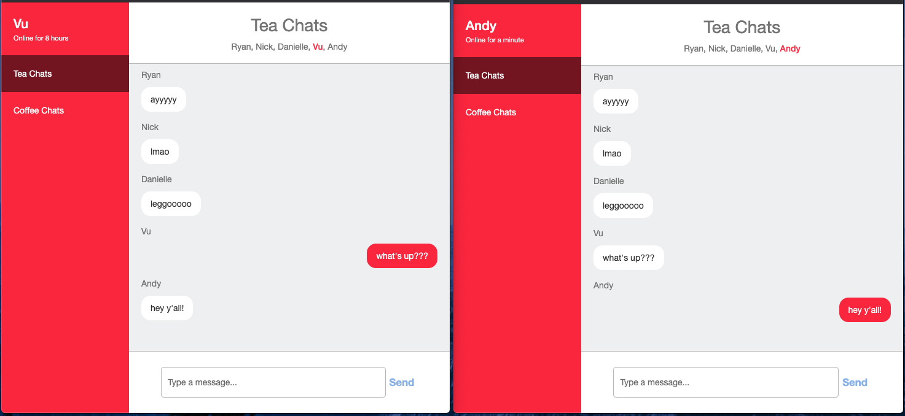

## DD Coding Challenge

This is a chat app built using ReactJS with a provided Node server. It utilizes `Socket.IO` for real-time updates in different browser tabs.

## Set up and dependencies

1. Clone the repo
2. Install the necessary NPM modules by running `yarn install`
3. Set up server with `yarn run api-server`
4. Open up another terminal and serve the app by running `yarn start`

## Features

### Session Storage

The logged in user is stored in the browser tab's sessionStorage in order to maintain logged in state if the user refreshes their tab. This was necessary before SocketIO was added because the user would have to re-login when they refreshed to see new messages.

### Online Duration

The `userInfo` component tracks the current user's online duration by utilizing the `react-moment` component library.

### Real-time Chat Update

Slight modification was made to the `server.js` file (lines 152-173) in order to set up a SocketIO client to listen to chat messages from the frontend and update the `ChatMessages` component in real-time. By utilizing SocketIO, users can see new messages without having to refresh their tab.

### Autoscrolling

The `ChatMessages` component will render a scrollbar when the list of messages become taller than the set component height. After the scrollbar appears, new messages will automatically scroll the user to the bottom of the chat.

## Potential Improvements

One thing that I would to do improve this project would be to add PropType validations to the components to help future engineers have a better experience continuing work on this app. Right now, it is not very clear what prop types are getting passed inside of components, but having PropType validations should give it more clarity.

Currently, I am using a mix of class-based components and function-based components. Switching over to React Hooks would allow the project to be more consistent and have only functional components and improve readability.
